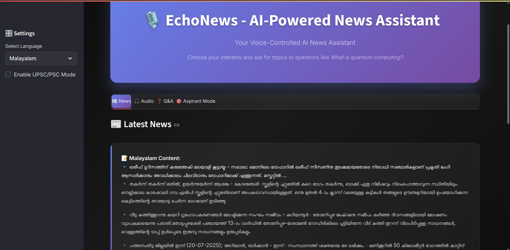
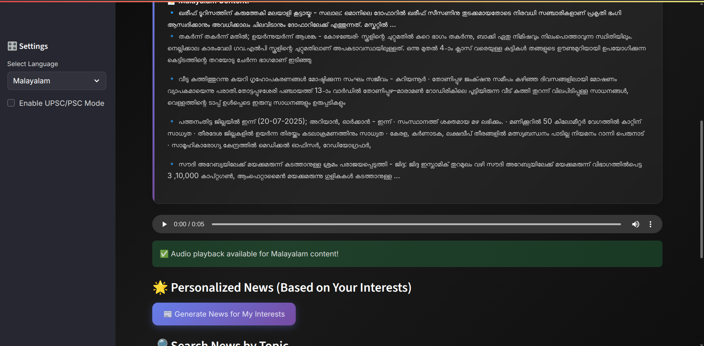
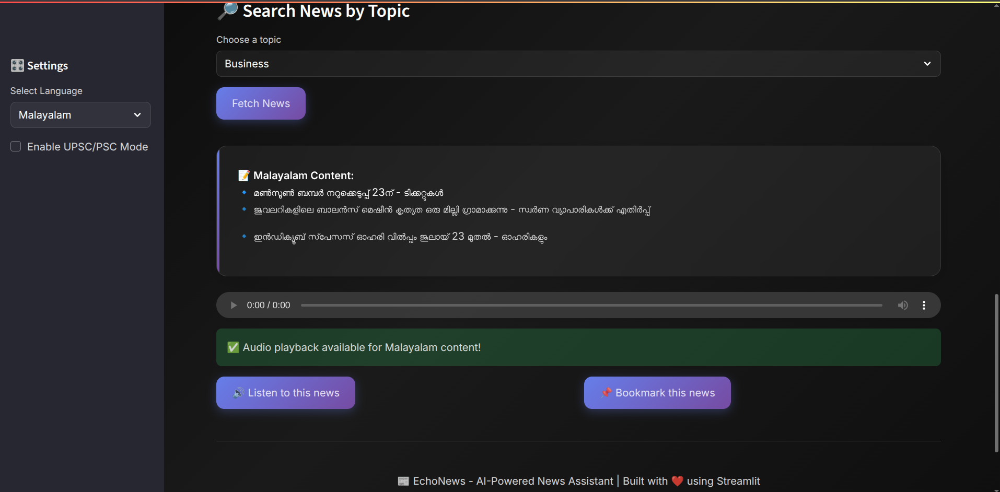
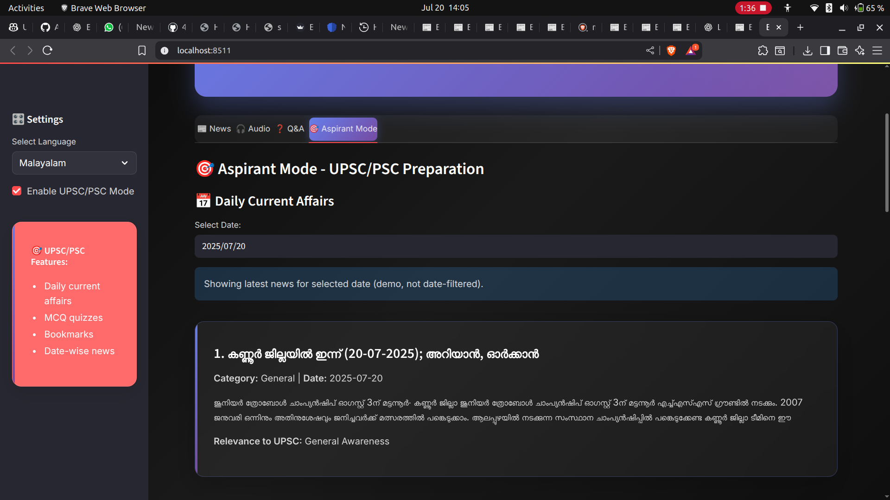
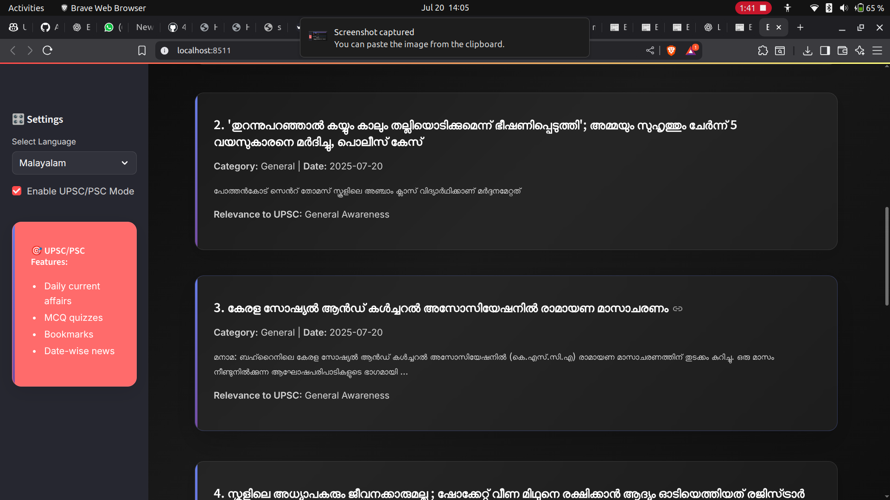
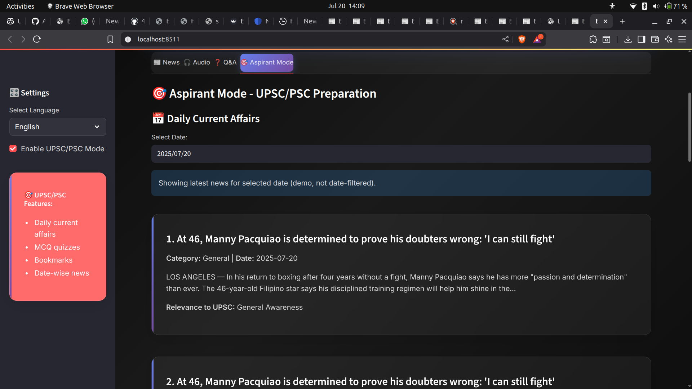

# EchoNews

## Basic Details

- **Team Name:** *IGNIS*
- **Team Members:** *Aiswarya K Binu, Afsheen Aziz, Afnash Ali P*
- **Track:** *Media*
- **Problem Statement:**  
  In today's fast-paced digital world, accessing personalized and reliable news is challenging due to information overload and the spread of misinformation.
- **Solution:**  
  EchoNews provides a curated news platform that delivers personalized content, leveraging advanced filtering techniques and user preferences to ensure the delivery of trustworthy and relevant news.
- **Project Description:**  
  EchoNews is a news aggregation and recommendation system that sources news from multiple APIs, filters articles based on user interest, and offers an interactive interface for browsing and sharing news. The system is developed primarily using Streamlit for the web interface, Python for backend logic, and Gemini for AI-powered features such as summarization and personalization.

## Technical Details

- **Tech Stack and Libraries Used:**
  - *Frontend & App Framework:* Streamlit
  - *Backend Logic:* Python
  - *AI/ML:* Gemini (Google AI model integration)
  - *APIs:* NewsAPI or similar news sources
  - *Other Libraries:* Requests, Pandas, Streamlit-Extras, etc.

- **Implementation:**
  - The user interface is built using Streamlit, providing fast, interactive, and visually appealing dashboards.
  - Python scripts handle data fetching, preprocessing, and integration with news APIs.
  - Gemini AI is used for news summarization, recommendations, and advanced personalization.
  - Users can set their preferences, view trending news, receive AI-powered summaries and recommendations, and save articles.
  - The platform is designed for easy deployment and sharing.

## Installation and Execution Instructions

1. **Clone the repository:**
   ```bash
   git clone https://github.com/Afsheen-Aziz/EchoNews.git
   cd EchoNews
   ```
2. **Install dependencies:**
   - It is recommended to use a Python virtual environment.
   ```bash
   python -m venv venv
   source venv/bin/activate   # On Windows: venv\Scripts\activate
   pip install -r requirements.txt
   ```
3. **Set up environment variables:**
   - Create a `.env` file in the project root with your NewsAPI key and Gemini credentials (if needed).
   - Example:
     ```
     NEWS_API_KEY=your_api_key_here
     GEMINI_API_KEY=your_gemini_api_key_here
     ```
4. **Run the Streamlit app:**
   ```bash
   streamlit run app.py
   ```
5. **Access the application:**
   - Open your browser and go to the local URL provided by Streamlit, usually `http://localhost:8501`

## Screenshots









---
